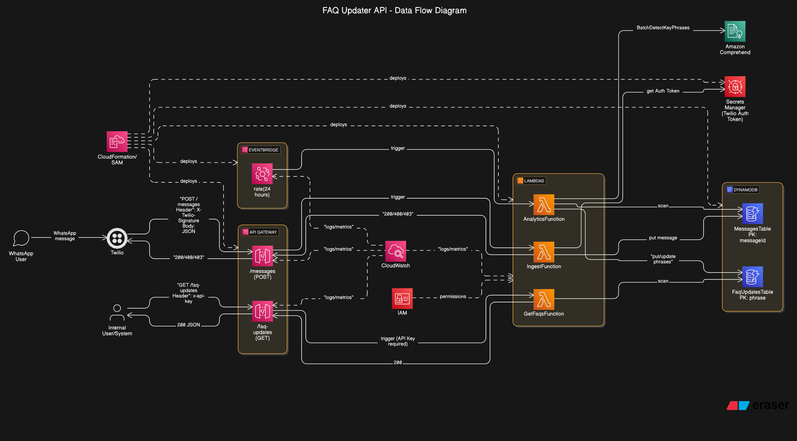

# FAQ Updater API

This project implements a serverless FAQ Updater API using AWS SAM (Serverless Application Model). The API allows for the ingestion of messages from Twilio/WhatsApp, analyzes these messages to extract key phrases, and provides an endpoint to retrieve the most frequently updated FAQs.

## Architecture



## Project Structure

```markdown
faq-updater-api
├── handlers
│   ├── __init__.py
│   ├── analytics.py
│   ├── get_faqs.py
│   └── ingest.py
├── template.yaml
├── requirements.txt
├── setup_secrets.py # Helper script for initial secret setup
└── README.md
```

## Prerequisites

AWS Account
AWS CLI configured with appropriate permissions (Secrets Manager, CloudFormation, Lambda, DynamoDB, API Gateway, IAM)
AWS SAM CLI installed
Python 3.9 installed
Docker installed and running (required by `sam build`)
Twilio Account (or similar provider) with Auth Token

## Configuration (One-Time Setup)

This application requires a Twilio Auth Token stored securely in AWS Secrets Manager.

1. **Install Script Dependencies:**

   ```bash
    pip install boto3
   ```

2. **Run Setup Script:** Execute the helper script to create the secret and optionally configure deployment defaults:

    ```bash
    python setup_secrets.py
    ```

    Follow the prompts to enter your AWS region and Twilio Auth Token.

    The script will output the **ARN** of the created/updated secret (e.g., `arn:aws:secretsmanager:us-east-1:123456789012:secret:FaqUpdater/TwilioAuthToken-xxxxxx`). **Copy this ARN.**

    You can optionally let the script update/create `samconfig.toml` to store deployment parameters like the region, stack name, and the secret ARN.

## Deployment

1. **Build the Application:** This step packages the Lambda functions and dependencies.

    ```bash
    sam build
    ```

2. **Deploy using SAM:**

    ```bash
    sam deploy --guided
    ```

    **Stack Name:** Choose a name (e.g., `faq-updater-api-prod`).
    **AWS Region:** Enter the same region used in the setup script.
    **Parameter `TwilioAuthTokenSecretArn`:** Paste the **Secret ARN** you copied during the configuration step. (If you updated `samconfig.toml` via the script, this might be pre-filled).
    **Confirm changes:** Review and confirm the deployment.
    **Save arguments:** Saving arguments to `samconfig.toml` is recommended for future deployments (`sam deploy`).

3. **Retrieve API Key:** After successful deployment, note the `ApiUrl` and `ApiKeyId` from the outputs.
    Go to the AWS Console -> API Gateway -> API Keys.
    Find the key matching the `ApiKeyId`.
    Click "Show" to reveal the API Key **value** and copy it securely.

## Usage

**Ingest Messages (`POST /messages`)**:

- Configure your WhatsApp provider (e.g., Twilio) webhook to point to the deployed `ApiUrl` + `/messages`.

- The API expects requests signed with the Twilio Auth Token (validation is performed).
  
- The request body should be JSON containing `MessageSid`, `From`, `Body`.

**Get FAQs (`GET /faq-updates`)**:

- Make a GET request to the deployed `ApiUrl` + `/faq-updates`.

- Include the API Key **value** (retrieved during deployment) in the `x-api-key` request header.

- Returns a JSON list of FAQs sorted by count (descending).

## Security Features

- **Secrets Management:** Twilio Auth Token stored securely in AWS Secrets Manager.

- **Request Validation:** `/messages` endpoint validates incoming Twilio request signatures.

- **API Key:** `/faq-updates` endpoint requires an API key for access.

- **IAM Least Privilege:** Functions have scoped IAM policies.

- **Data Retention:** Raw messages in `MessagesTable` have a default TTL (Time To Live) configured (currently 30 days in `handlers/ingest.py`).

- **Logging:** API Gateway access logging is enabled.
